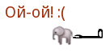

<!SLIDE subsection transition=uncover>

# Функциональный стиль #

<!SLIDE bullets incremental transition=uncover>

.notes Вы спросите почему?

Кроме этого, рекомендую *не использовать* методов вообще:

* Проще оперировать экземплярами:
* Функция будет работать с любыми типами 
* И требовать от них только то, что нужно ей

<!SLIDE transition=uncover>

# Пример из Python #

    @@@python
    class SomeClass:

        def method(self, param1, param2):
            . . .

(обратите внимание на *self*)            

<!SLIDE transition=uncover>

.notes Без IDE можно забыть интерфейс, нужно их все держать в памяти, лишние классы, делать интерфейс для каждого отдельного метода довольно странно, обычно это наборы методов 

# Интерфейсы в Java #

    @@@java
    public interface CanMeow { // МожетМяукать
    	void meow(); // мяукнуть
    }	

    public interface IsCat extends CanMeow { // ЯвляетсяКошкой
        void pullTail(); // дёрнутьХвост
    }

    public void pullTail(IsCat cat) { ... }
    public void doMeow(CanMeow meowable) { ... }

Осьмикошка может мяукать, но у неё нет хвоста!

<!-- (It have no tail and it cannot be pulled) -->

<!SLIDE transition=uncover>

.notes Можно даже не проверять тип: при вызове выбросится исключение

# JavaScript #

    @@@javascript
    function doMeow(mayBeCanMeow) { // можетУмеетМяукать
    	if (!mayBeCanMeow.meow) { // mayBeCanMeow.meow !== undefined
    		throw new Error('Не умеет мяукать :(');
    	} 
    	// в случае функций можно даже обойтись без проверки
    	mayBeCanMeow.meow();
    }

    doMeow({}); // Не умеет мяукать!
    doMeow(petya); // Не умеет мяукать!
    doMeow({'meow': function() { console.log('Мяу!'); } }); // Мяу!
    doMeow(octocat); // Мяу!
    doMeow(elephantWhoCanMeow); // слонУмеющийМяукать: Мяу!

<!SLIDE transition=uncover>

# Без методов #

    @@@javascript
    function pullTail(possiblyCat) { // можетКошка
        if (!possiblyCat.tail) throw new Error('Нет хвоста :(');
        console.log((possiblyCat.name ? withTail.name : 'Неизвестный') +
                    ' говорит «Ай!»');
    }

    pullTail({}); // Нет хвоста!
    pullTail(petya); // Нет хвоста!
    pullTail(musya); // Муся говорит «Ай!»
    pullTail(elephant); // Слон говорит «Ай!»
    pullTail(octocat); // Нет хвоста!

<!SLIDE transition=uncover>

<!-- Египетская рука дёргает слона за хвост -->

<!SLIDE transition=uncover>

# На практике: #
    
    @@@javascript
    var myChain = { head: null };
    var divOne = { type: 'div', 'next': null };
    var divTwo = { type: 'table', 'next': null };
    divOne.next = divTwo;
    myChain.head = divOne;

    function walk(chain, func) {
    	var cursor = chain.head;
    	while (cursor != null) {
    		func(cursor);
    		cursor = cursor.next;
    	}
    }

    walk(myChain, function(elm) { console.log(elm.type) } );
    > 'div' 
    > 'table'

<!SLIDE transition=uncover>

# Кратко! #

<!SLIDE transition=uncover>

.notes По переменным не понятно, что от них ожидается

# Всегда документируйте функции! #

(помечайте описанные где-либо в документации типы или ожидания)

<!SLIDE transition=uncover>

## Но надо объединить функции для работы с цепочками (кошками) в одно место! ##