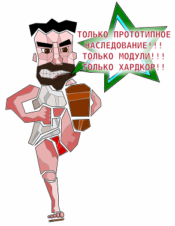

<!SLIDE transition=fade>
.notes Заголовок

# Правильный JavaScript #

## Будь спартанцем! ##

WebStandardsDays, 2011 (c)

<!SLIDE transition=uncover>
.notes 1. В блоге пишу о разном-упоротом. 2. Можете обзывать так друзей 3. Написал добрую половину жаваскрипта для фотохостинга Nikon, использую его в работе и just for fun лет шесть. И ещё я пишу на Java, но не говорите никому об этом.

# Про автора #

## <shaman.sir> ##

* Веду блог [«Ни слова о луке»](http://shamansir-ru.tumblr.com)
* Опытный Жабоскриптёр
* Нет, правда

<!SLIDE bullets incremental transition=uncover>

# Расскажу про #

* ООП в JavaScript
* (и почему это не всегда хорошо)
* Почему прототипы лучше
* Как развлекаться с объектами в JS
* Про функциональный стиль
* Про модульный подход

<!SLIDE bullets incremental transition=uncover>

# И кроме этого #

* От объектов к прототипам
* Миксыны
* (наверное так правильно)
* +Бонус 

<!SLIDE transition=uncover>

# Итак, начали #