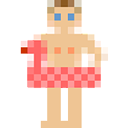

<!SLIDE transition=fade>
.notes Заголовок

# Правильный JavaScript #

## Будь спартанцем! ##

WebStandardsDays, 2011 ©

<!SLIDE transition=uncover>
.notes 1. В блоге пишу о разном-упоротом. 2. Можете обзывать так друзей 3. Написал добрую половину жаваскрипта для фотохостинга Nikon, использую его в работе и just for fun лет шесть. И ещё я пишу на Java, но не говорите никому об этом.

# Про автора #

## <shaman.sir> ##

* Веду блог [«Ни слова о луке»](http://shamansir-ru.tumblr.com)
* Опытный Жабоскриптёр
* Нет, правда
* И ещё [я есть на гитхабе](http://shamansir.github.com)

Poolparty smile is the property of Skype Limited ©</a>

http://www.patwreck.com/wordpress/wp-content/uploads/2010/04/13d68eccc211e88c0867f1c6a0ef92e986147a71_s.gif

<!SLIDE bullets incremental transition=uncover>

# Расскажу #

* Пару слов об ООП
* (и почему это не всегда хорошо)
* Почему прототипы лучше
* Как развлекаться с объектами в JS
* Про функциональный стиль
* Про модульный подход

<!SLIDE bullets incremental transition=uncover>

# И кроме этого #

* Миксыны
* (наверное так правильно)
* +Бонус
* Литература 

<!SLIDE transition=uncover>

## У меня полчаса, поэтому очень сжато ##

(но не в ущерб шоу и смыслу)

<!SLIDE transition=uncover>

# Итак, начали #