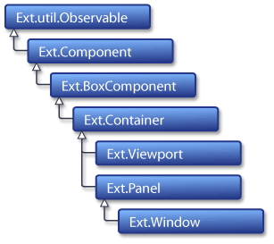
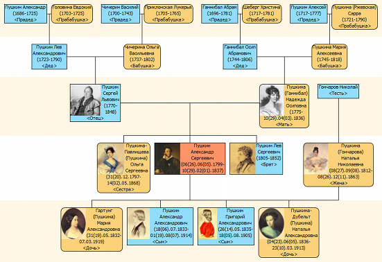
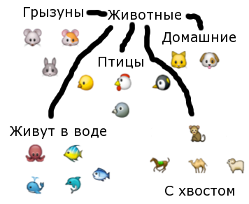

<!SLIDE subsection transition=uncover>

# ООП #

<!SLIDE transition=uncover>

В школе нас учили наследованию...

http://tsdsu.co.uk/files/diploma-and-graduation-hat.jpeg

<!SLIDE transition=uncover>

.notes По сути наследование – почти то же, что классификация [БЫСТРО ПЕРЕКЛЮЧИТЬ]

http://img3.sencha.com/files/learn/Ext2-Container-hierarchy.gif

<!SLIDE transition=uncover>

.notes Ой, это картинка из другого доклада. Давайте возьмём живой пример

# Впрочем, так скучно #

## Возьмём живой пример ##

<!SLIDE transition=uncover>

http://www.genery.com/sites/all/themes/gen2/images/screen/pushkin.png

<!SLIDE transition=uncover>

# Пока что тоже не то #

<!SLIDE transition=uncover>

.notes Это немного необычная классификация

# Банальная классификация животных! #

.notes Здесь всё банально, рыбки от рыбок, кошки от кошек, лошади от лошадей – и всё это животные. Обычно создаются более сложные иерархии и абстракции

These Emoji are the property of Apple Inc.</a>

<!SLIDE transition=uncover>

# Как это выглядит в JavaScript? #

    @@@javascript
    function Animal(type) {
        this.type = type;
	}

    Animal.prototype.meet = function(other) {
        return this.type + ' meets ' + other.type + '.' 
    }

    function Cat() {
    	Cat.superclass.constructor.apply(this, 'Cat');
    }
    var F = function() { }
    F.prototype = Animal.prototype
    Cat.prototype = new F()
    Cat.prototype.constructor = Cat
    Cat.superclass = Animal.prototype

    function Dog() {
    	Dog.superclass.constructor.apply(this, 'Dog');
    }
    var F = function() { }
    F.prototype = Animal.prototype
    Dog.prototype = new F()
    Dog.prototype.constructor = Dog
    Dog.superclass = Animal.prototype

    var cat = new Cat('Cat');
    var dog = new Animal('Dog');
    cat.react(dog);
    > Cat meets Dog

<!SLIDE transition=uncover>

.notes Плохо, потому что не то. Американцы бы сказали Oh My GOD!

# ОЧЕНЬ ПЛОХО, правда? #

(хоть и можно обернуть в функцию)

<!SLIDE transition=uncover>

Попробуем разобраться в сложном и перейдём к простому

<!SLIDE transition=uncover>

Что, если у нас есть необычное животное?