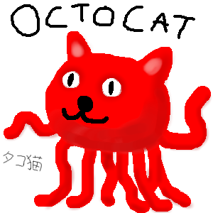
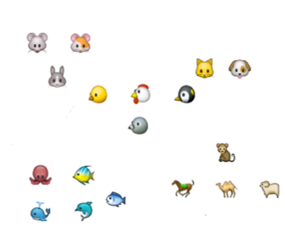
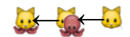
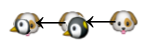

<!SLIDE subsection transition=uncover>

# Прототипное наследование #

<!SLIDE transition=uncover>

Например, такое...

(okutokettu)

Octocat Logo is the property of GitHub Inc.</a>

<!SLIDE transition=uncover>

.notes В природе такое встречается редко, но вот когда мы разрабатываем сложную систему, у нас часто появляются сложные компоненты 

Или вот такое...

(dogudakku)

<!SLIDE bullets incremental transition=uncover>

* Куда же его в втиснуть в иерархии?
* 
* Может и не надо?

<!SLIDE bullets incremental transition=uncover>

* Может лучше не наследовать, а *клонировать*?
* 
* Клонировать, а потом *настраивать*
* 

<!SLIDE transition=uncover>

# Классов нет, есть только экземпляры #

<!SLIDE bullets incremental transition=uncover>

* Нет никаких иерархий
* Всегда есть образец
* Взяли кошку у соседей, клонировали, добавили щупальца
* 
* Взяли собаку у соседей, клонировали, добавили клюв
* 

<!SLIDE transition=uncover>

* Вася – клон Пети, но с другим именем
* Тумбочка – клон шкафа, но меньше по высоте
* Шкаф – клон тумбочки, но выше и с вешалками
* Диван – клон кресла, но шире и раздвигается

<!SLIDE transition=uncover>

TIMTOWTDY

<!SLIDE transition=uncover>

.notes Намеренно использую маленькую букву - это экземпляры

    @@@javascript
    var petya = Object.create(null); // или Object.create();
    petya.name = 'Petya';
    petya.greet = function() { console.log('I am ' + this.name); }

    var vasya = Object.create(petya);
    vasya.name = 'Vasya';
    vasya.greet();
    > 'I am Vasya' 

<!SLIDE transition=uncover>

.note Фабрика кошек (но не осьмикощек, мы не планируем их наследовать, не будем преумножать сущности).

    @@@javascript
    var cat = function(subtype) {
    	return {
    		type: subtype || 'cat',
    		identify: function() {
	    		console.log('My type is ' + this.type); }
    	};
    }

    var octocat = new cat('octocat');
    octocat.identify();
    > 'My type is octocat'

<!SLIDE transition=uncover>

Не надо преумножать сущности

<!SLIDE transition=uncover> 

.notes Если мы хотим что-то запретить

    @@@javascript
    var cat = function(subtype) {
    	return {
    		...
    		meow: function() {console.log('meow');}
    	};
    }

    var octocat = new cat('octocat');
    octocat.meow = function() { throw new Error('I am not a simple cat!'); };
    // или octocat.meow = undefined;
    octocat.meow();
    > Error

<!SLIDE transition=uncover>

.notes Если мы всё же решили наследовать осьмикошек. Кстати, так работает instanceof

    @@@javascript
    function cat() {
        this.type = 'cat';
    }
    cat.prototype = {
      react: function(who) { 
	           console.log(this.type + ' reacts on ' + who); }
    };

    function octocat() {}

    octocat.prototype = new cat();
    octocat.prototype.type = 'octocat';
    octocat.prototype.tentacles = 6;
    octocat.prototype.constructor = octocat;

    var superoctocat = new octocat();
    superoctocat.tentacles = 8;
    superoctocat instanceof cat
    > true

<!SLIDE bullets incremental transition=uncover>

* Кстати...
* В первых двух примерах `instanceof` не работает
* но зачем он, если есть *Duck Typing*  