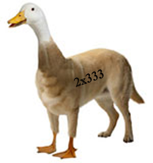
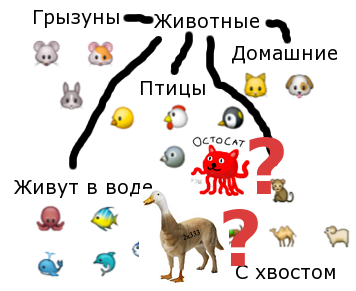
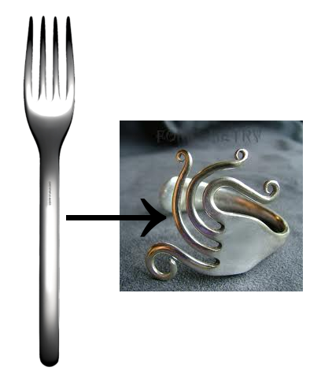
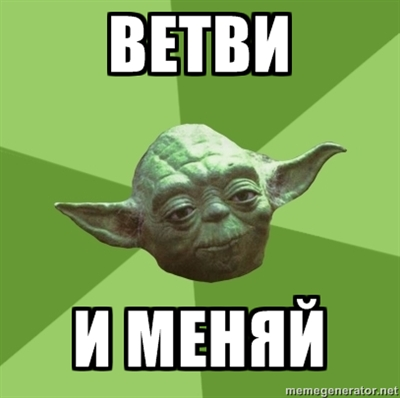

<!SLIDE subsection transition=uncover>

# Прототипное наследование #

<!SLIDE transition=uncover>

## Например, такое... ##

(タコ猫 / オクトケツ)

Octocat is drawn by David OReilly</a>

<!SLIDE transition=uncover>

.notes В природе такое встречается редко, но вот когда мы разрабатываем сложную систему, у нас часто появляются сложные компоненты 

## Или вот такое... ##

(ドッギダック)

http://api.ning.com/files/XWzZwWqhuPRomBff4H4uwRgDFRP5xMX2YaYZ-eBmoTPYEZfIZddJ4HwYt1-0Ca9CZ6Ph1dkR5-ipAYpSAERdjZTBXA-oRL5L/dogduck.jpg

<!SLIDE not-fit bullets incremental transition=uncover>

# И что тогда? #

* Куда же его в втиснуть в иерархии?
* 
* Может и не надо?

<!SLIDE cloning bullets incremental transition=uncover>

Может...

* Может лучше не наследовать, а *клонировать*?
* 
* Клонировать, а потом *настраивать*
* 

<!SLIDE transition=uncover>

# Классов нет, есть только экземпляры #
 

<!SLIDE making bullets incremental transition=uncover>

* Нет никаких иерархий
* Всегда есть образец
* Взяли кошку у соседей, клонировали, добавили щупальца
* 
* Взяли собаку у соседей, клонировали, добавили клюв
* 

<!SLIDE transition=uncover>

* Вася – клон Пети, но с другим именем
* Тумбочка – клон шкафа, но меньше по высоте
* Шкаф – клон тумбочки, но выше и с вешалками
* Диван – клон кресла, но шире и раздвигается

<!SLIDE transition=uncover>

# TIMTOWTDI #

(Есть больше одного способа сделать это)

<!SLIDE transition=uncover>

.notes Object.create - нововведённая функция, есть не везде. Намеренно использую маленькую букву - это экземпляры

    @@@javascript
    var petya = Object.create(null); 
                // или Object.create();
    petya.name = 'Петя';
    petya.greet = function() 
	              { console.log('Я – ' + this.name); }

    var vasya = Object.create(petya); 
                // NB: копируются ссылки!
    vasya.name = 'Вася';
    vasya.greet();
    > 'Я – Вася'
    
<!SLIDE forks transition=uncover>

http://www.christofle.com/files/products/02415003-1-612-0-dinner-fork.png;
http://t2.gstatic.com/images?q=tbn:ANd9GcSkHf8gTj0iRpiZzl3Sdhxwi0gYgd8shxUhelDw7OkPoZfB3fp26HZKx4pd

<!SLIDE transition=uncover>

## Fork and change ##

(UNIX, GitHub, ...)

<!SLIDE transition=uncover>

.notes Фабрика кошек (но не осьмикошек, мы не планируем их наследовать, не будем преумножать сущности). Маруся - тёплое ламповое имя для кошки. Буэ – франзуское.

    @@@javascript
    var cat = function(cname) {
    	return {
    		// новое для каждого клона
    		name: cname || 'Маруся',
    		// новая для каждого клона 
    		identify: function() {  
	    		console.log('Я – ' + this.name); }
    	};
    }

    var octocat = new cat('Буэ');
    octocat.identify();
    > 'Я – Буэ'

<!SLIDE>

.notes Чуть более правильный вариант

    @@@javascript
    var catProto = {
    		name: 'Маруся', // одно на всех
    		identify: function() { // одна на всех
	    		console.log('Я – ' + this.name); }
    	};

    var cat = function(cname) { this.name = cname; };
    cat.prototype = catProto;

    // "Создать по прототипу"
    var octocat = new cat('Буэ');
    octocat.identify();
    > 'Я – Буэ'

<!-- <!SLIDE transition=uncover> 

.notes Если мы хотим что-то запретить

    @@@javascript
    var catProto = {
    		...
    		fear: function() {console.log('ШШШШШШ!');}
    	};

    . . .

    var octocat = new cat('Буэ');
    octocat.fear = function() { throw new Error('Я не просто кошка!'); };
    // или octocat.fear = undefined;
    octocat.fear();
    > Error -->

<!SLIDE transition=uncover>

.notes Если мы всё же решили наследовать осьмикошек. Псевдоклассическое наследование. Присвоение `prototype.constructor` не влияет на `instanceof`, это заблуждение. Это исправление затёртого в предыдущей строке свойства `constructor`, Свойство `constructor` копируется между всеми экземплярами, созданными от данной функции.

    @@@javascript
    function cat(name) { // у каждого
        this.name = name || 'Маруся'; // новое у каждого
        this.kittens = [];
    }
    cat.prototype = { // статика
        react: function(who) { // общая для клонов ф-ция
	           console.log(this.name + 
		                   ' реагирует на ' + who); }
    };

    function octocat() {} 
    octocat.prototype = new cat(); // клонируем...
    octocat.prototype.constructor = octocat;// можно без

    // ...и изменяем
    octocat.prototype.name = 'Буэ'; // общее свойство
    octocat.prototype.tentacles = 6;

    var superoctocat = new octocat(); // клонируем...
    superoctocat.tentacles = 8; // ...и изменяем
    superoctocat instanceof cat;
    > true
    superoctocat.name // всех клонов зовут "Буэ"
    > 'Буэ'

<!SLIDE transition=uncover>

    @@@javascript
    function cat(name) { // у каждого
        this.name = name || 'Маруся'; // новое у каждого
        this.kittens = [];
    }
    cat.prototype = { // статика
        react: function(who) { // общая для клонов ф-ция
	           console.log(this.name + 
		                   ' реагирует на ' + who); }
    };

    function octocat() {} 
    octocat.prototype = new cat(); // клонируем...
    octocat.prototype.constructor = octocat;

    var boo = new octocat();
    boo.kittens
    > []
    var woo = new octocat();
    woo.kittens.push('Гоша');
    woo.kittens
    > ["Гоша"]
    boo.kittens
    > ["Гоша"] // Oooopps!!! 

<!SLIDE transition=uncover>

.notes Передаём имя через конструкторы. Совсем правильный вариант.

    @@@javascript
    function cat(name) { // у каждого
        this.name = name || 'Маруся'; // новое у каждого
        this.kittens = []; // новый массив у кажд. клона
    }
    cat.prototype = { // статика
    	react: function(who) { // общая для клонов ф-ция
	           console.log(this.name + 
		                   ' reacts on ' + who); }
    };

    function octocat(name) { // функция создания клона
	    cat.call(this,name || 'Буэ'); // <---- !!! ВАЖНО
	    this.tentacles = 6; // новое св-во у каждого
	}
    octocat.prototype = new cat('Буэ'); // клон-шаблон
    octocat.prototype.global = ...; // общая

    var superoctocat = new octocat('Чак');
    superoctocat.tentacles = 8;
    superoctocat instanceof cat;
    > true
    superoctocat.name
    > 'Чак'

<!SLIDE transition=uncover>

    @@@javascript
    var superoctocat = new octocat('Чак');

* Создаётся полностью пустой объект
* Его прототипом становится экземпляр `cat`, общий для всех экземпляров `octocat`
* Этот экземпляр расширен другими свойствами, поэтому они тоже переносятся в прототип
* Вызывается конструктор `octocat()` ()
* Получившийся объект возвращается и передаётся в `superoctocat`

<!SLIDE protochain transition=uncover>

    superoctocat [instance of octocat]
        { name: 'Чак' }
        octocat.prototype [instance of cat] 
                { name: 'Буэ' }
            cat.prototype
                { react: ... }
                Object.prototype
                       { toString: ... /* и т.д. */ }

Modified from http://bonsaiden.github.com/JavaScript-Garden/#object.prototype                

<!SLIDE transition=uncover>

Для работы с клонированием нужны:

   * Любая функция, которая конструирует / инициализирует клон: клонировщик
   * Прототип (клонируемое): любой объект, описывающий методы и свойства, которые должны содержатся в 
                             каждом новом клоне (могут наполняться позже).
   * Это один, общий для всех сконструированных экземпляров (и функции), объект                         
   * Свойство `prototype` у функции – именно этот объект                         
   * Вызови `new` с этой функцией и получи клон

<!SLIDE transition=uncover>

.notes Программисты очень не хотят использовать имя родительского класса и заводят свои обёртки

Сложности начинаются, когда оказывается нужен `super`:

    @@@javascript
    octocat.prototype.react=function(who){ 
	    cat.prototype.react.call(this, who); 
	                               // вспомните self
	    console.log('Перехвачено в octocat');
    }

<!SLIDE transition=uncover>

## Но `super` не имеет смысла, если мы *клонируем* ##

## Кто такой `super`? ##

<!SLIDE bullets incremental transition=uncover>

.notes Именно прикручивание ООП внесло в JS много костылей. Не забывайте оператор `new` и вам не нужно будет костылей

## Зачем вообще нам наследование, ##

## если есть *Duck Typing* ##

<!SLIDE transition=uncover>

## Не надо преумножать сущности ##

<!SLIDE transition=uncover>
